# Fast-Track 24h SLA Monitors

The fast-track 24h monitors start a deadline when eligibility decisions allow the claim
and watch for payout acknowledgements. If the payout confirmation is missing when the
scheduled timer fires, the monitors publish a breach metric and alert; otherwise they
record an on-time metric.

If generated, open [diagrams/monitors.fasttrack-24h.svg](../../diagrams/monitors.fasttrack-24h.svg)
for a zoomable view of the graph.

```dot
digraph G {
  rankdir=LR;
  subgraph cluster_0 {
    label="fasttrack.sla.start.v1";
    m0_n0 [label="S_fasttrack_sla_start_v1_event
Subscribe"];
    m0_n1 [label="T_fasttrack_sla_start_v1_when_cond_1
Transform"];
    m0_n0 -> m0_n1;
    m0_n2 [label="K_schedule
Keypair"];
    m0_n1 -> m0_n2;
    m0_n3 [label="T_schedule_corr
Transform"];
    m0_n2 -> m0_n3;
    m0_n4 [label="T_schedule_reply_to
Transform"];
    m0_n3 -> m0_n4;
    m0_n5 [label="P_schedule_request
Publish"];
    m0_n4 -> m0_n5;
    m0_n6 [label="S_schedule_reply
Subscribe"];
    m0_n5 -> m0_n6;
  }
  subgraph cluster_1 {
    label="fasttrack.sla.check.v1";
    m1_n0 [label="S_fasttrack_sla_check_v1_event
Subscribe"];
    m1_n1 [label="T_lookup
Transform"];
    m1_n0 -> m1_n1;
    m1_n2 [label="T_branch_1_cond_1
Transform"];
    m1_n1 -> m1_n2;
    m1_n3 [label="P_breach_metric
Publish"];
    m1_n2 -> m1_n3;
    m1_n4 [label="K_alert
Keypair"];
    m1_n3 -> m1_n4;
    m1_n5 [label="T_alert_corr
Transform"];
    m1_n4 -> m1_n5;
    m1_n6 [label="T_alert_reply_to
Transform"];
    m1_n5 -> m1_n6;
    m1_n7 [label="P_alert_request
Publish"];
    m1_n6 -> m1_n7;
    m1_n8 [label="S_alert_reply
Subscribe"];
    m1_n7 -> m1_n8;
    m1_n9 [label="P_on_time_metric
Publish"];
    m1_n8 -> m1_n9;
  }
}
```

