# Auto Quote → Bind → Issue (v2)

The quote pipeline validates incoming requests, prices the risk, applies underwriting
rules, and composes a bindable offer. Once the applicant signs, it issues the policy,
schedules the first payment, and emits operational telemetry for tracking.

Render the [source DOT file](../../../diagrams/auto.quote.bind.issue.v2.dot) with Graphviz to
produce an SVG when you need a zoomable view of the graph:

```bash
dot -Tsvg diagrams/auto.quote.bind.issue.v2.dot -o out/0.6/tmp/auto.quote.bind.issue.v2.svg
```

```dot
digraph G {
  rankdir=LR;
  n0 [label="S_quote_quote
rpc:req:api/quote/submit"];
  n1 [label="T_validate_request
jsonschema.validate"];
  n0 -> n1;
  n2 [label="T_rate
model_infer"];
  n1 -> n2;
  n3 [label="T_risk_rules
policy_eval"];
  n2 -> n3;
  n4 [label="T_offer
compose"];
  n3 -> n4;
  n5 [label="K_bind
Ed25519"];
  n4 -> n5;
  n6 [label="T_bind_corr
hash"];
  n5 -> n6;
  n7 [label="T_bind_reply_to
concat"];
  n6 -> n7;
  n8 [label="P_bind_request
rpc:req:api/bindings/sign"];
  n7 -> n8;
  n9 [label="S_bind_reply
@reply_to_bind"];
  n8 -> n9;
  n10 [label="K_issue
Ed25519"];
  n9 -> n10;
  n11 [label="T_issue_corr
hash"];
  n10 -> n11;
  n12 [label="T_issue_reply_to
concat"];
  n11 -> n12;
  n13 [label="P_issue_request
rpc:req:api/policy/issue"];
  n12 -> n13;
  n14 [label="S_issue_reply
@reply_to_issue"];
  n13 -> n14;
  n15 [label="K_schedule_first_payment
Ed25519"];
  n14 -> n15;
  n16 [label="T_schedule_first_payment_corr
hash"];
  n15 -> n16;
  n17 [label="T_schedule_first_payment_reply_to
concat"];
  n16 -> n17;
  n18 [label="P_schedule_first_payment_request
rpc:req:api/payments/schedule"];
  n17 -> n18;
  n19 [label="S_schedule_first_payment_reply
@reply_to_schedule_first_payment"];
  n18 -> n19;
  n20 [label="P_metric
metric:quote.bind.issue.completed"];
  n19 -> n20;
  n21 [label="P_ack
@quote_msg.reply_to"];
  n20 -> n21;
}
```


